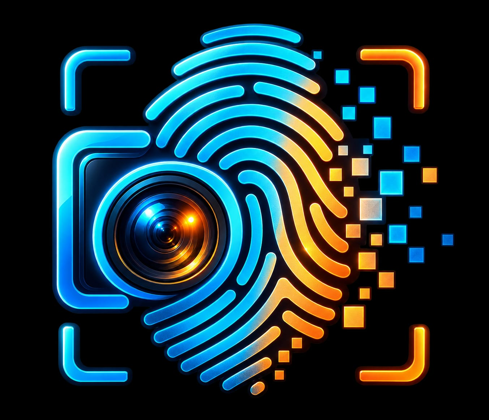

<p align="center">
  
</p>

<h1 align="center">Digital Tattoo</h1>

Digital Tattoo is a cybersecurity project I built to explore how information we can unknowingly share while using the internet.

The idea started with photo metadata. A normal photo can have hidden information such as the device model, date and time and sometimes even GPS location. While working on that I became interested in ways we leave information behind online so I expanded the project to include browser privacy and website privacy as well.

The project now has three parts:

- Photo Metadata Scanner

- Browser Privacy Scanner

- Website Privacy Scanner

## 📷 Photo Metadata Scanner

This part allows the user to upload a photo and check the metadata available inside it.

Depending on the image it can reveal information such as:

- Device manufacturer and model

- Date and time

- GPS information

- Other available metadata

I also added a metadata cleaning feature so that the user can remove metadata from the image and compare the image before and after cleaning.

While building this part I learned about EXIF metadata and how something simple as sharing a photo can sometimes reveal more information than we expect.

I also came across XMP and IPTC metadata while working on the project. I understand their purpose but I'm still learning how they work in more detail.

## 🌐 Browser Privacy

After working with photo metadata I wanted to show that photos aren't the way information can be exposed.

The browser privacy section shows some of the information a browser can make available when we visit a website.

This introduced me to browser fingerprinting. The idea that different characteristics of a browser and device can be combined to help distinguish one user from another.

I'm still exploring this topic. Learning how fingerprinting works technically.

## 🔎 Website Privacy Scanner

The third part of the project looks at website privacy.

I added this because I wanted Digital Tattoo to go beyond photo privacy and show ways our online activity can leave traces.

I'm currently learning more about the concepts behind website privacy analysis and plan to improve this part as I learn.

## 💻 Technologies I Used

- Python

- Flask

- Pillow (PIL)

- HTML

- CSS

- JavaScript

- Git and GitHub

## 🚀 Running the Project

Clone the repository:

```bash

git clone https://github.com/yogithasathish27/digital-tattoo.git

```

Go into the project folder:

```bash

cd tattoo

```

Install the requirements:

```bash

pip install -r requirements.txt

```

Run the application:

```bash

python app.py

```

Then open the local Flask address shown in the terminal.

## 🔒 Privacy

Test photos, uploaded images my virtual environment and other local development files are excluded from this repository using.gitignore.

## 📚 What I'm Learning From This Project

Digital Tattoo is also a learning project for me. I didn't start this project already knowing every concept used in it.

Far working on it has helped me understand more about:

- Image metadata and privacy

- EXIF and GPS metadata

- Metadata removal

- Basic browser fingerprinting

- Python and Flask

- Git and GitHub

There are still parts I'm learning especially XMP/IPTC metadata, browser fingerprinting in more depth, website privacy analysis and some parts of the implementation.

I'll continue updating the project as I learn more.

## 👩‍💻 About Me

I'm Yogitha Sathish, a B.E. Computer Science and Engineering (Cyber Security) student, I'm currently exploring different areas of cybersecurity, with a particular interest in Ethical Hacking and Security Engineering.

This is one of the projects I'm building as part of my cybersecurity learning journey.